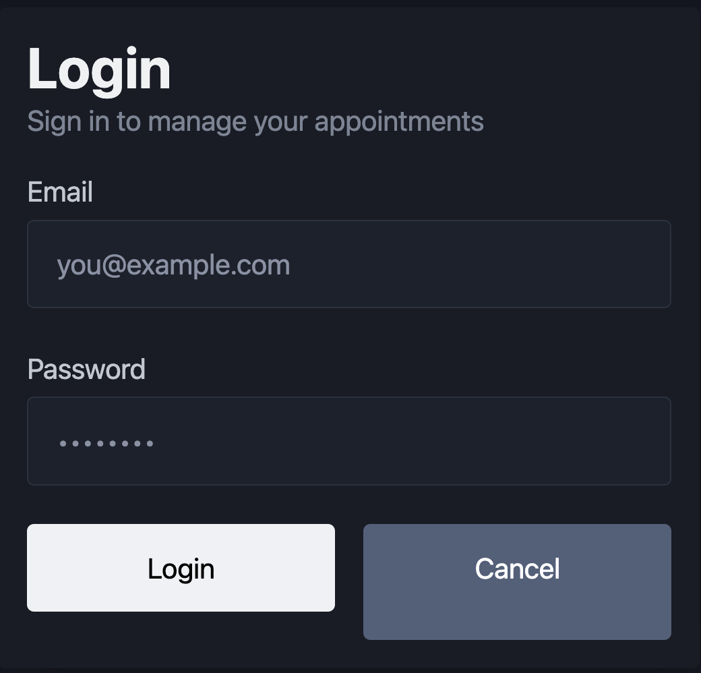
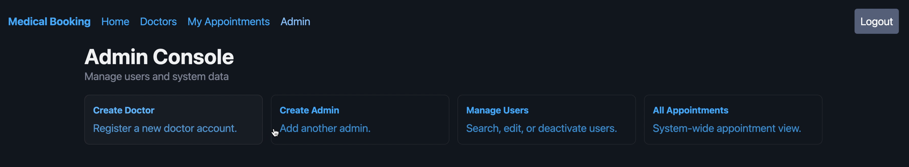
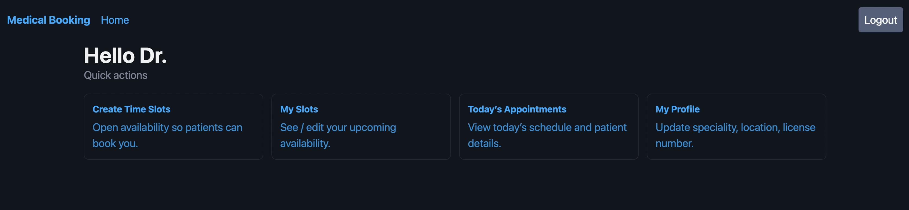
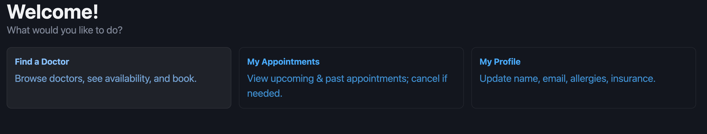
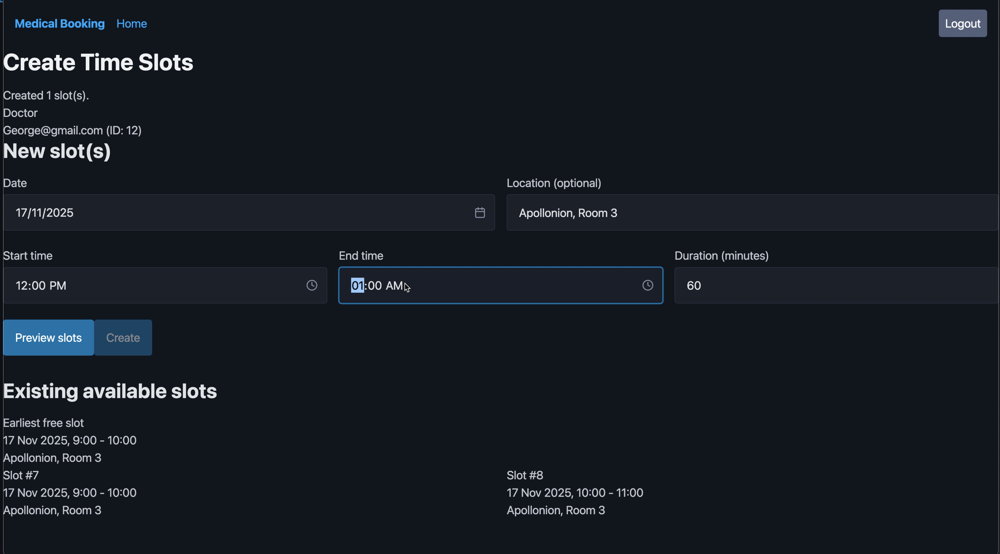
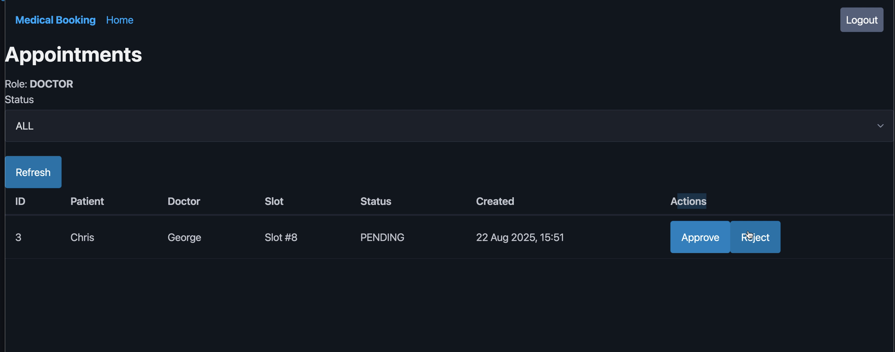
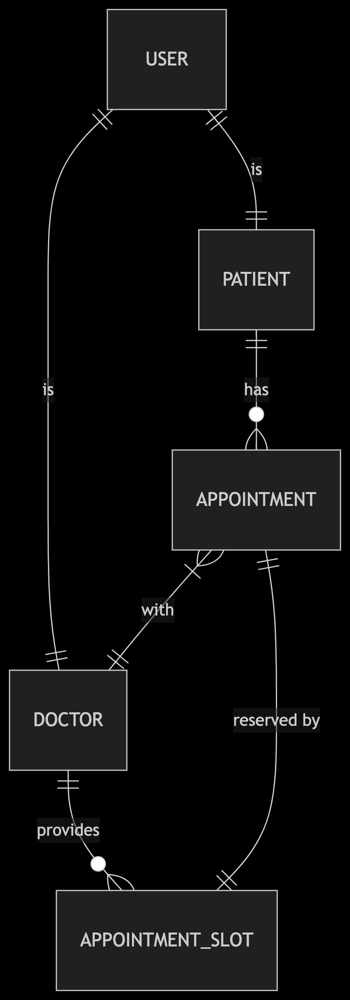
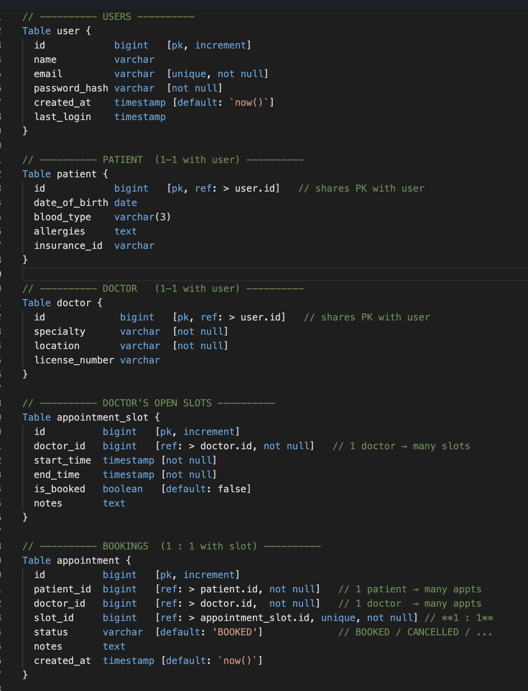

# 🏥 Healthcare Booking App

End-to-end medical appointments platform — patients book visits, doctors manage availability, admins oversee operations.

---

## 🧷 Frontend Repo

- **Web:** https://github.com/Xenios7/Healthcare-Booking-Frontend  

---

## 🧰 Tech Stack
- **Frontend:** JavaScript, React, Vite, HTML5/CSS3
- **Backend:** Java, Spring Boot, PostgreSQL, Spring Security (JWT), JPA, Swagger, Maven
- **Containerization:** Docker (Dockerfile)
- **Cloud & Infra:** Koyeb (Web & API), Managed PostgreSQL, HTTPS/TLS
- **Testing:** JUnit 5 (Spring Boot Test)

---

## ✅ Testing

- **Frameworks:** JUnit 5, Spring Boot Test, RestAssured, Testcontainers (PostgreSQL), Hamcrest
- **Style:** Full integration tests against a real PostgreSQL container (no in-memory DB)
- **Main coverage:**
  - End-to-end booking flow (patient books → doctor confirms → lists by doctor/patient)
  - AuthN/AuthZ with JWT (401/403 paths + admin happy path)
  - Repository seeding & FK cleanup per test

### Requirements
- Docker running (Testcontainers starts a `postgres:15-alpine` container)

### Run all tests
mvn test

---

## 🐳 Containerization (Docker) & Cloud (Koyeb)

The API is packaged as a Docker image and deployed on Koyeb as a managed container service. This ensures the **same artifact** runs in CI and production, with an HTTP health check (`/actuator/health`), environment-based configuration (DB URL, `JWT_SECRET`, etc.), and HTTPS termination provided by Koyeb. Docker Compose is available for **optional local development** (PostgreSQL + Adminer), but the project is **cloud-first**—build the image, deploy to Koyeb, run at scale.

**Big picture**
- **Build:** Multi-stage `Dockerfile` (Java 21, non-root) → Docker image
- **Deploy:** Koyeb builds/pulls the image and runs it as `healthcare-booking-api`
- **Runtime:** Health checks, logs, secrets, and scaling are managed by Koyeb

---

## 🚀 Live Demo (Cloud-only)

Everything runs in the cloud — **no local setup required**.

- **Web:** https://medicalbooking.koyeb.app/
- **API:** https://medicalbooking-api.koyeb.app/ → Swagger at `/swagger-ui`
- **Region/Platform:** Frankfurt (eu-central-1) on Koyeb
- **Database:** Postgres v17 (`ep-cold-scene-a2ffs6hj.eu-central-1.pg.koyeb.app`)

> ⚠️ Local development is **optional** and not needed for trying the app. This README is **cloud-first** because the frontend points to the cloud API.

---

## ✨ Features

- **Appointment lifecycle.** 
  Create, confirm, cancel, and list appointments. Server-side validation prevents double-booking and enforces slot ownership and status transitions.
- **Availability management.**
   Doctors publish availability as discrete time slots; bookings atomically reserve a slot to ensure consistency under concurrency.
- **Authentication & authorization.**
   JWT-based authentication with role-based access control (Patient, Doctor, Admin). Passwords are stored as secure hashes via Spring Security.
- **RESTful API with documentation.** 
  Consistent resource design and error handling. OpenAPI specification with Swagger UI for exploration and client generation.
- **Data model.**
   Normalized PostgreSQL schema with referential integrity (FKs) and timestamp auditing on key entities.
- **Security & configuration.** 
  Environment-driven secrets (e.g., JWT secret), production CORS policy, and HTTPS termination at the edge (Koyeb).
- **Observability.**
   Health endpoint for liveness/readiness checks and basic operational monitoring.

---

## 📸 Preview

<p align="center">
  <br/>
  <sub><b>Login</b></sub>
</p>

<!-- Dashboards -->
<table>
<tr>
  <td align="center">
    <br/>
    <sub><b>Admin – Dashboard</b></sub>
  </td>
  <td align="center">
    <br/>
    <sub><b>Doctor – Dashboard</b></sub>
  </td>
</tr>
<tr>
  <td colspan="2" align="center">
    <br/>
    <sub><b>Patient – Dashboard</b></sub>
  </td>
</tr>
</table>

<!-- Doctor time slots & appointments (last) -->
<table>
<tr>
  <td align="center">
    <br/>
    <sub><b>Doctor – Create Time Slots</b></sub>
  </td>
  <td align="center">
    <br/>
    <sub><b>Doctor – Appointments</b></sub>
  </td>
</tr>
</table>


> 💡 Tip: Keep images ~1200px wide for crisp rendering. PNG for UI, SVG/PNG for diagrams.

---

## 🎥 Demo Video

Place your video under `docs/` and it will appear here.

- **High quality (download/preview):** `docs/demo.mov`  
- **Best browser compatibility:** convert a copy to MP4 → `docs/demo.mp4`

<!-- Inline player (works best with .mp4); GitHub may still render as a link -->
<video src="docs/demo.mp4" controls width="720">
  Your browser does not support the video tag.
  <a href="docs/demo.mp4">Download the demo video</a>.
</video>

---

## 🧠 Architecture

Export your diagram to `docs/architecture.png`.

**Flow:** Web (React) → API (Spring Boot) → PostgreSQL  
**Auth:** JWT (role-based endpoints)  
**Deploy:** Koyeb (Frankfurt, eu-central-1)


---

## 🗄️ Database

## 🧩 ERD
<p align="center">
  <a href="ERD_BookingAPI.png">
    
  </a>
</p>


### 📋 Entities & Tables (baseline)

<p align="center">
  <a href="ERD_BookingAPI.png">
    
  </a>
</p>

---

## 📚 API Docs

- **Prod Swagger:** `https://medicalbooking-api.koyeb.app/swagger-ui`  
- **OpenAPI JSON:** `https://medicalbooking-api.koyeb.app/v3/api-docs`

> 🧪 Local Swagger links are omitted because this project is cloud-first and the frontend targets the cloud API.

---

## ☁️ Deployment (Koyeb)

- **Web:** `healthcare-booking-frontend` → https://medicalbooking.koyeb.app/  
- **API:** `healthcare-booking-api` → https://medicalbooking-api.koyeb.app/  
- **Database:** Postgres v17 → `ep-cold-scene-a2ffs6hj.eu-central-1.pg.koyeb.app`


---

## 🗂️ Project Structure (Hub)

```
.
├─ docs/
│  ├─ architecture.png
│  ├─ erd.png
│  ├─ demo.mov        # optional (original)
│  ├─ demo.mp4        # recommended for inline playback
│  └─ screens/
│     ├─ landing.png
│     ├─ booking.png
│     ├─ calendar.png
│     └─ admin.png
└─ README.md
```

---

## 🔐 Security Notes

- Never commit secrets or `.env` files  
- Use a strong `JWT` secret in production; rotate periodically  
- HTTPS/TLS handled by Koyeb (use the HTTPS URLs)

---

## ❓ FAQ

- **Why isn’t there a local “docker compose up” here?**  
  The app is **cloud-first** and the frontend points to the **cloud API**. You can use the live demo without any local setup.

- **Can I still run locally later?**  
  Yes — if you add local envs and point the frontend to a local API; that’s outside the scope of this README since the current code targets the cloud API.
