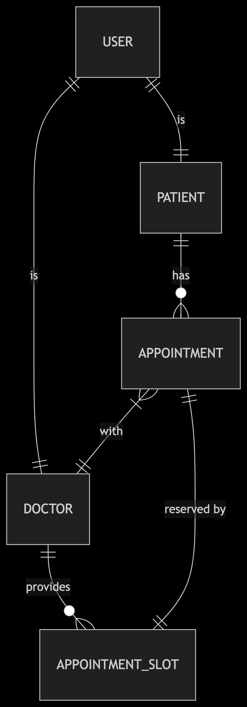

# 🏥 Healthcare Booking App

End-to-end medical appointments platform — patients book visits, doctors manage availability, admins oversee operations.

---

## 🧷 Repositories

- **API:** https://github.com/Xenios7/Healthcare-Booking-Api  
- **Web:** https://github.com/Xenios7/Healthcare-Booking-Frontend  

> Looking for implementation details? See each repo’s README. This hub is the product page.

---

## 🚀 Live Demo (Cloud-only)

Everything runs in the cloud — **no local setup required**.

- **Web:** https://medicalbooking.koyeb.app/
- **API:** https://medicalbooking-api.koyeb.app/ → Swagger at `/swagger-ui`
- **Region/Platform:** Frankfurt (eu-central-1) on Koyeb
- **Database:** Postgres v17 (`ep-cold-scene-a2ffs6hj.eu-central-1.pg.koyeb.app`)

> ⚠️ Local development is **optional** and not needed for trying the app. This README is **cloud-first** because the frontend points to the cloud API.

---

## ✨ Features

- 📅 Appointment booking flow (create, confirm, cancel)
- 👥 Role-based access (patient / doctor / admin)
- 🗓️ Doctor availability & calendar view
- 🔐 JWT authentication
- 📜 OpenAPI/Swagger documentation
- 🌐 Cloud deployment on Koyeb (web + API + DB)

---

## 🧰 Tech Stack

- **Backend:** Spring Boot, PostgreSQL, JWT  
- **Frontend:** React  
- **Infra:** Koyeb (Web, API, DB)

---

## 🎥 Demo Video

Place your video under `docs/` and it will appear here.

- **High quality (download/preview):** `docs/demo.mov`  
- **Best browser compatibility:** convert a copy to MP4 → `docs/demo.mp4`

<!-- Inline player (works best with .mp4); GitHub may still render as a link -->
<video src="docs/demo.mp4" controls width="720">
  Your browser does not support the video tag.
  <a href="docs/demo.mp4">Download the demo video</a>.
</video>

---

## 📸 Screenshots

Put images in `docs/screens/` (use any filenames). A few examples:

- `docs/screens/landing.png`  
- `docs/screens/booking.png`  
- `docs/screens/calendar.png`  
- `docs/screens/admin.png`

> 💡 Tip: Keep images ~1200px wide for crisp rendering. PNG for UI, SVG/PNG for diagrams.

---

## 🧠 Architecture

Export your diagram to `docs/architecture.png`.

**Flow:** Web (React) → API (Spring Boot) → PostgreSQL  
**Auth:** JWT (role-based endpoints)  
**Deploy:** Koyeb (Frankfurt, eu-central-1)


---

## 🗄️ Database

## 🧩 ERD
<p align="center">
  <a href="ERD_BookingAPI.png">
    
  </a>
</p>


### 📋 Entities & Tables (baseline)

> Replace/extend with your exact fields as implemented.

#### `users`
| field         | type         | notes                          |
|---------------|--------------|--------------------------------|
| id            | UUID (PK)    |                                |
| email         | varchar(255) | unique                         |
| password_hash | varchar(255) |                                |
| role          | enum         | `PATIENT` `DOCTOR` `ADMIN`     |
| created_at    | timestamptz  | default now()                  |
| updated_at    | timestamptz  |                                |

#### `patients`
| field        | type                   | notes             |
|--------------|------------------------|-------------------|
| id           | UUID (PK/FK→users.id)  | one-to-one user   |
| first_name   | varchar(100)           |                   |
| last_name    | varchar(100)           |                   |
| dob          | date                   |                   |
| phone        | varchar(30)            |                   |
| insurance_no | varchar(100)           | nullable          |

#### `doctors`
| field          | type                   | notes                 |
|----------------|------------------------|-----------------------|
| id             | UUID (PK/FK→users.id)  | one-to-one user       |
| specialization | varchar(120)           |                       |
| bio            | text                   | nullable              |
| clinic_id      | UUID (FK→clinics.id)   | nullable              |

#### `clinics`
| field   | type           | notes |
|---------|----------------|-------|
| id      | UUID (PK)      |       |
| name    | varchar(150)   |       |
| address | text           |       |
| phone   | varchar(30)    |       |

#### `availability_slots`
| field        | type                   | notes                                 |
|--------------|------------------------|---------------------------------------|
| id           | UUID (PK)              |                                       |
| doctor_id    | UUID (FK→doctors.id)   |                                       |
| start_time   | timestamptz            |                                       |
| end_time     | timestamptz            |                                       |
| is_recurring | boolean                | default false                         |
| rrule        | varchar(255)           | RFC 5545 rule if recurring (optional) |

#### `appointments`
| field      | type                     | notes                                        |
|------------|--------------------------|----------------------------------------------|
| id         | UUID (PK)                |                                              |
| patient_id | UUID (FK→patients.id)    |                                              |
| doctor_id  | UUID (FK→doctors.id)     |                                              |
| start_time | timestamptz              |                                              |
| end_time   | timestamptz              |                                              |
| status     | enum                     | `PENDING` `CONFIRMED` `CANCELLED` `COMPLETED`|
| notes      | text                     | nullable                                     |
| created_at | timestamptz              | default now()                                |

#### `notifications` (optional)
| field   | type                  | notes                         |
|---------|-----------------------|-------------------------------|
| id      | UUID (PK)             |                               |
| user_id | UUID (FK→users.id)    |                               |
| channel | enum                  | `EMAIL` `SMS` `PUSH`          |
| type    | varchar(50)           | e.g., `APPT_CONFIRMED`        |
| payload | jsonb                 |                               |
| status  | enum                  | `QUEUED` `SENT` `FAILED`      |
| sent_at | timestamptz           | nullable                      |

---

## 📚 API Docs

- **Prod Swagger:** `https://medicalbooking-api.koyeb.app/swagger-ui`  
- **OpenAPI JSON:** `https://medicalbooking-api.koyeb.app/v3/api-docs`

> 🧪 Local Swagger links are omitted because this project is cloud-first and the frontend targets the cloud API.

---

## ☁️ Deployment (Koyeb)

- **Web:** `healthcare-booking-frontend` → https://medicalbooking.koyeb.app/  
- **API:** `healthcare-booking-api` → https://medicalbooking-api.koyeb.app/  
- **Database:** Postgres v17 → `ep-cold-scene-a2ffs6hj.eu-central-1.pg.koyeb.app`

> 🔒 Make sure secrets (DB URL/creds, JWT secret, etc.) are stored in Koyeb and **not** committed.

---

## 🗂️ Project Structure (Hub)

```
.
├─ docs/
│  ├─ architecture.png
│  ├─ erd.png
│  ├─ demo.mov        # optional (original)
│  ├─ demo.mp4        # recommended for inline playback
│  └─ screens/
│     ├─ landing.png
│     ├─ booking.png
│     ├─ calendar.png
│     └─ admin.png
└─ README.md
```

---

## 🔐 Security Notes

- Never commit secrets or `.env` files  
- Use a strong `JWT` secret in production; rotate periodically  
- HTTPS/TLS handled by Koyeb (use the HTTPS URLs)

---

## ❓ FAQ

- **Why isn’t there a local “docker compose up” here?**  
  The app is **cloud-first** and the frontend points to the **cloud API**. You can use the live demo without any local setup.

- **Can I still run locally later?**  
  Yes — if you add local envs and point the frontend to a local API; that’s outside the scope of this README since the current code targets the cloud API.
